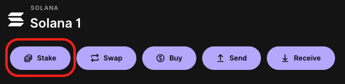

# How to Stake SOL on a Ledger

This guide provides a step-by-step tutorial on how to stake Solana (SOL) using a Ledger wallet. Follow these simple steps to start earning staking rewards.
If you don't know or have a Ledger device, you can learn more [here](https://www.ledger.com/).

## Prerequisites
- Ensure your Ledger device is set up and the Solana (SOL) app is installed.
- Ensure you have SOL in your Ledger wallet.
- Ensure you have Ledger Live installed on your computer (or go to [Ledger Live](https://www.ledger.com/ledger-live))

## Steps to Stake SOL with Ledger

### Step 1: Open Ledger Live
- Open Ledger Live on your computer and go to the "Accounts" tab.

### Step 2: Access Your Solana Account
- On the "Accounts" tab, find your Solana account and click on it.

### Step 3: Select the Staking Option
- In the wallet interface, click on the "Stake" button.

### Step 4: Choose the Kevred Validator
- Click on "Show all" to see all the validators and select the Kevred Validator from the list. Write "kevred" in the search bar to find it quickly.

### Step 5: Select the Amount to Stake
- Enter the amount of SOL you wish to stake and **confirm the transaction on your Ledger** by following the on-screen instructions. Be careful to keep a small amount of SOL in your wallet to pay for the transaction fees.

### Step 6: Confirmation and Monitoring
- After confirming the transaction, your SOL will be staked with the chosen validator.
- You can check the status of your staking in the wallet interface by clicking on "Accounts", then clicking on your Solana account and scrolling down to the "Delegations" section.

## Steps to Unstake Your SOL
If you decide to retrieve your SOL, you will need to follow the steps to "unstake" or "undelegate" your SOL, which is available in the "Delegations" section. Note that there may be a cooldown period during which your SOL will remain locked before they can be withdrawn.

## Additional Tips
- **Validator Selection**: Choosing a reliable and fair validator is crucial as it affects your staking rewards. We maintain our commission as low as possible.
- **Liquidity**: Keep in mind that staked SOL are not immediately liquid. Plan your finances accordingly.

Thank you for choosing Kevred as your Solana validator!

*Graet e Breizh*