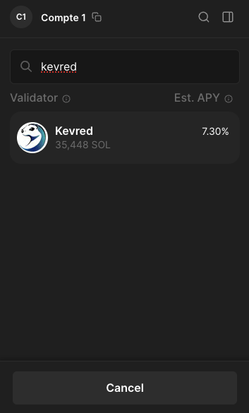
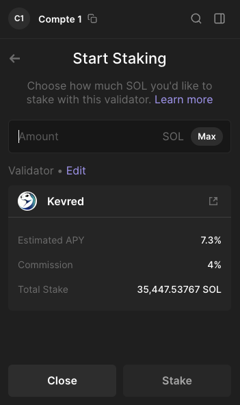
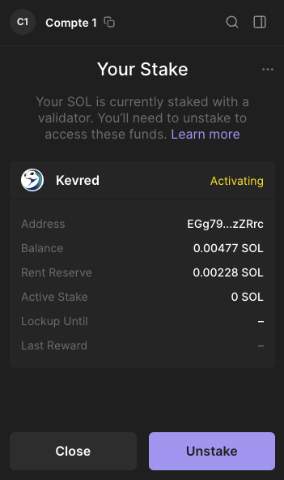

# How to Stake SOL with Phantom Wallet

This guide provides a step-by-step tutorial on how to stake Solana (SOL) using the Phantom wallet. Follow these simple steps to start earning staking rewards with Kevred.

## Prerequisites
- Ensure that the Phantom wallet is installed on your browser. You can download it from the [Phantom official website](https://phantom.app/).
- Make sure you have some SOL in your Phantom wallet.

## Steps to Stake SOL with Phantom

### Step 1: Open Your Phantom Wallet
- Click on the Phantom icon in your browser's extension bar to open your wallet and enter your password.

### Step 2: Select the Solana Token
- Click on the Solana Token.

### Step 3: Select the Stake Option
- Click on "Start Earning SOL"

### Step 4: Choose the Native Staking Option
- Click on "Native Staking". Be aware that native staking offers increased security, direct network support and simplicity whereas liquid staking offers more flexibility and liquidity but introduces additional risks.

### Step 5: Choose the Kevred Validator
- Phantom will display a list of available validators. These validators are nodes that process transactions and support the Solana network.
- Write "Kevred" in the search bar to find the Kevred Validator.

### Step 6: Delegate Your SOL
- Enter the amount of SOL you wish to stake and confirm the transaction.

### Step 7: Confirmation and Monitoring
- After confirming the transaction, your SOL will be staked with Kevred. Thank you ! 
- You can check the status of your staking in Phantom by visiting "Your stake" section.

## Steps to Unstake Your SOL

### Step 1: Open your stake account
- Click on the Solana token in your Phantom wallet.
- Open your stake account by clicking on "Your stake" in Phantom.

### Step 2: Unstake your SOL
- Click on "Kevred" to see your stake details.
- Click on "Unstake" to start the unstaking process.
- **You will be able to withdraw your SOL after some days once the stake account becomes inactive.**

## Additional Tips
- **Validator Selection**: Choosing a reliable validator is crucial as it affects your staking rewards.
- **Liquidity**: Keep in mind that staked SOL are not immediately liquid. There is a cooldown period if you decide to withdraw your funds from staking.

By following this tutorial, you can actively support the Solana network while earning staking rewards. Happy staking with us ! 

*Graet e Breizh*

