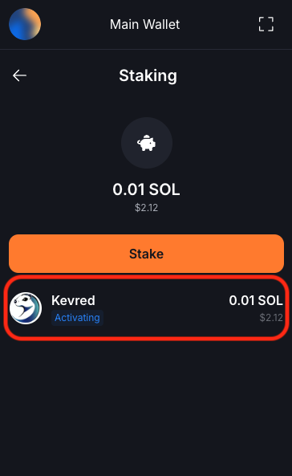
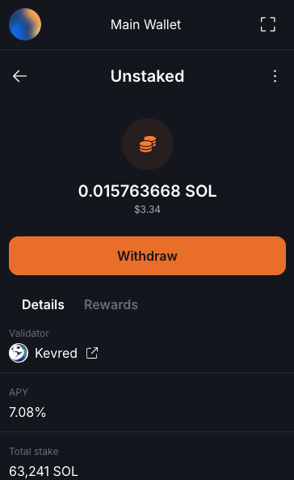

# How to do Liquid Staking with The Vault

!!! 
This tutorial assumes you already know what is liquid staking. If you don't, please read "What is Staking ?" first. 
!!!

This guide provides a step-by-step tutorial on how to stake Solana (SOL) to Kevred using The Vault.

The Vault is a liquid staking protocol that allows users to stake their SOL while still benefiting from the liquidity of their assets. It is a well known protocol that has about 1M SOL staked to more than 100 validators.
vSOL is the liquid staking token that represents your staked SOL, its value increases over time because the pool earns staking rewards.

If you want to know more about the Vault, you can read their documentation [here](https://docs.thevault.finance/) or join their discord. They have a very active community and a very good support.

## Prerequisites
- Ensure that you have a Solana compatible wallet like Solflare, Phantom, etc.
- Make sure you have some vSOL in your wallet. You can swap some SOL to vSOL on [Jupiter](https://jup.ag/swap/SOL-vSOL).
- Make sure to understand the concept of liquid staking.

## Steps to Stake SOL to Kevred with the Vault

### Step 1: Open the Vault direct stake page
- Go to the [Vault direct stake page](https://thevault.finance/dapp/direct/) and select "Kevred" as the validator.

### Step 2: Select the "Stake" option
- Click on the "Stake" option on the main menu.

### Step 3: Select the Kevred Validator
- Solflare will display a list of available validators. These validators are nodes that process transactions and support the Solana network.
- Write "kevred" in the search bar to find the Kevred Validator. Solflare validator is recommended by the wallet by default but you can choose another one (ours had a better APY when I did the tutorial)

### Step 4: Delegate Your SOL
- Enter the amount of SOL you wish to stake and confirm the transaction.

### Step 5: Confirmation and Monitoring
- After confirming the transaction, your SOL will be staked with Kevred. Thank you ! 
- You can check the status of your staking in Solflare by clicking on the Solana token in your wallet and then on "Staking".
- **At this point, your staking will be "activating" and will be active at the end of the epoch (which can last about 2 days). Click on it to see "Time to stake". Then, you will start earning rewards. Well done.**

### Step 6: Monitoring your rewards
- You can check the status of your rewards in Solflare by clicking on one of your stake account and then on "Rewards".
- **When your stake is active, your will receive staking rewards every 2-3 days.**

## Steps to Unstake Your SOL

### Step 1: Open your stake account
- Click on the Solana token and then on "Staking" in your Solflare wallet.
- Open one of your stake account.

### Step 2: Unstake your SOL
- Click on the three dots and then on "Unstake" to start the unstaking process.
- **You could have to wait a few days before you can withdraw your SOL, depending on the timing.**

### Step 3: Confirm the transaction
- Confirm the transaction and wait for the unstaking to be completed. You will receive your SOL and rewards back to your wallet.

## Additional Tips
- **Validator Selection**: Choosing a reliable validator is crucial as it affects your staking rewards.
- **Liquidity**: Keep in mind that staked SOL are not immediately liquid. There is a cooldown period if you decide to withdraw your funds from staking.

By following this tutorial, you can actively support the Solana network while earning staking rewards. Happy staking with us ! 

*Graet e Breizh*

