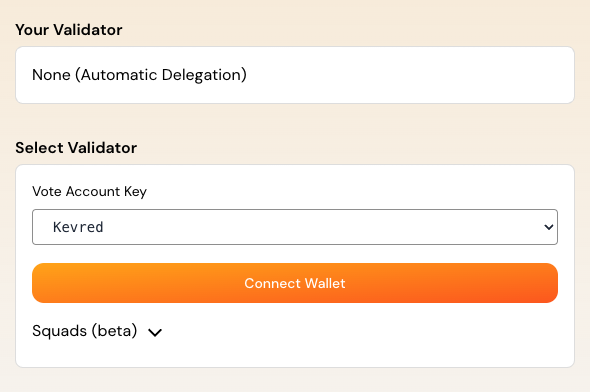

# How to do Liquid Staking with The Vault

!!! 
This tutorial assumes you already know what is liquid staking. If you don't, please read "What is Staking ?" first. 
!!!

This guide provides a step-by-step tutorial on how to stake Solana (SOL) to Kevred using The Vault.

The Vault is a liquid staking protocol that allows users to stake their SOL while still benefiting from the liquidity of their assets. It is a well known protocol that has about 1M SOL staked to more than 100 validators.
vSOL is the liquid staking token that represents your staked SOL, its value increases over time because the pool earns staking rewards.

If you want to know more about the Vault, you can read their documentation [here](https://docs.thevault.finance/) or join their discord. They have a very active community and a very good support.

*Please note that Kevred has been added to The Vault as a validator. That's why you can directly stake your vSOL to Kevred.*

## Prerequisites
- Ensure that you have a Solana compatible wallet like Solflare, Phantom, etc.
- Make sure you have some vSOL in your wallet. You can swap some SOL to vSOL on [Jupiter](https://jup.ag/swap/SOL-vSOL).
- Make sure to understand the concept of liquid staking.

## Steps to Stake SOL to Kevred with the Vault

### Step 1: Open the Vault direct stake page
- Go to the [Vault direct stake page](https://thevault.finance/dapp/direct/) and select "Kevred" as the validator.

### Step 2: Connect your wallet
- Click on "Connect Wallet" and select your wallet.

### Step 3: Direct Stake your vSOL
- Once your wallet is connected, you will see the amount of vSOL you have in your wallet
- You will be able to direct stake your vSOL to Kevred by clicking on "Direct Stake" and that's it ! 

!!!
The Vault will delegate you vSOL automatically to Kevred. But, make sure to keep your vSOL in a place The Vault can track otherwise it will be delegated using their default delegation strategy. More info here : [The Vault documentation](https://docs.thevault.finance/users/validator-target-stake)
!!!

## Additional Tips
- **Validator Selection**: You can change the validator at any time on the Vault direct stake page. We are using Kevred in this example because it is our validator.
- **Come back to SOL**: You can exchange vSOL back to SOL on many platformes like Jupiter.

By following this tutorial, you can actively support the Solana network while earning staking rewards. Happy staking with us ! 

*Graet e Breizh*

